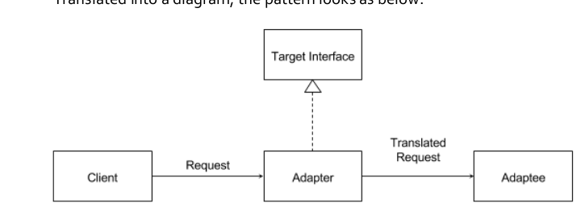
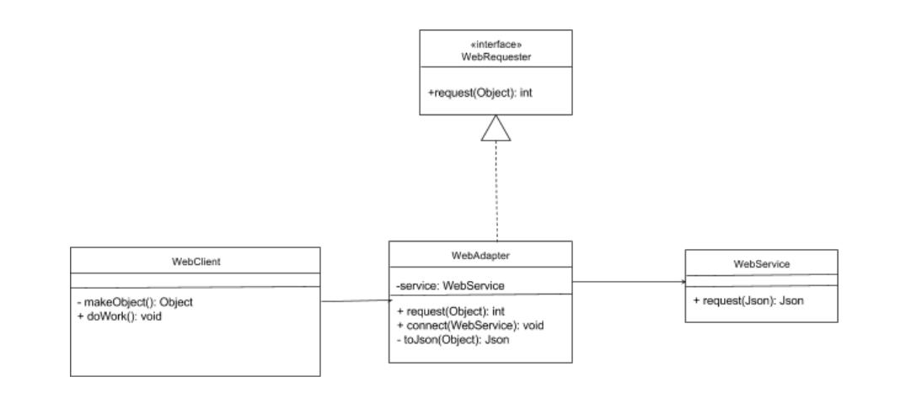

# Adapter Pattern

## Using scenario

Tutorial
>1. Lecture p.23
>2. Video: https://www.coursera.org/learn/design-patterns/lecture/RRZST/2-1-6-adapter-pattern

Serveral parts the adapter pattern consits

>1. Client
>2. Adaptee
>3. The Adapter class(It implements the interface  Target Interface, which is the interface the client will use)

The adapter class therefore is a wrapper class.

## The logic of adapter pattern

- The adapter conforms what the client is expecting to see.
- The client send request to adapter to  using the target interface, the adapter will then translate the request into a message that the adaptee will understand.

## An Example of using adapter pattern

