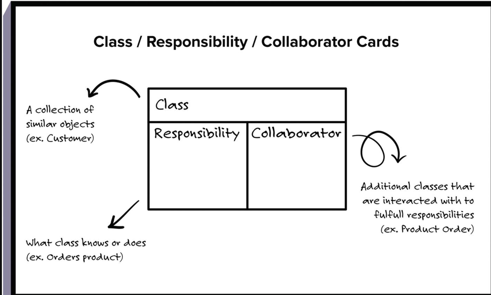

# Course Orientation

Build resuable, maintainable, flexiable code.

The course instructor try to aline with ACM/IEEE Software Engineering Curriculumn Guidelines.

This series consists four courses

>1. Object-Oriented Design
>2. Deisgn-Patterns
>3. Software architecture
>4. Service-Oriented Architecture

## Software design and the Software architecture

>1. Software Design: Looks at the lower-leve aspect of a system
>2. Software architecture: Looks at the higher-level aspects of a system

## Object-Oriented Modeling

When solving a problem, object-oriented modeling involves the practice of representing key concepts through objects in your software.

## Desin in the Software Process

Evidence suggests that diving straight into implementation work is a leading cause of project failure.

>1. Requirements
>2. Design(Including conceptual design and technical design)

Ask clients trade off, requirements(including potential one). Thinking about your software's

>1. Structure
>2. Behavoirs

Design activity involves 
>1. Conceptual design mocks up
>2. Technical design diagrams
>3. Implementation

The more clear your conceptual design is, the better your technical design will be.

Continuously check with client that your mockup capture what they want.

- Requirements

Requirements are conditions or capabiilities that must be implemented in a product, based on client or user request.

  - In order to elicit requirements, it is important to ask for more than simply the client's vision, instead, eliciting requirements involves actively probling the client vision,
clarifying what may not have not been told.

  - Trade off

## Components

Components turn into a collection of functions, classes, or other components. These pieces then represent a much simpler problem that the developers can individually implement.

## Competing quality and trade off

- What must to be done
- What is good enough

## Class Responsibility collaborator(CRC)

Represents
>1. Class
>2. Responsibility
>3. Collaborator(connections)

CRC cards are used to record, organize, refine the components in your design.

**Colaborator** are other classes that the class interacts with to fullfill its responsibilities.

Keep the component and class small(single responsibility?)