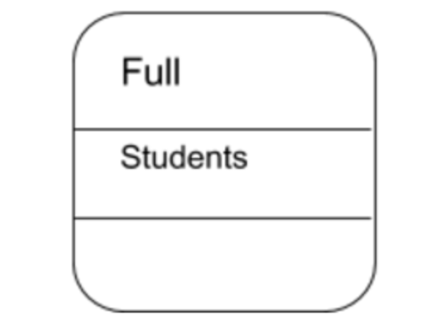

# State Diagrams

- **State diagrams** can describe a single object and illustrage how that object behaves in response to a series of events in your system.
- **State**  is the way an object exists at a particular point in time. The state of an object is determined by the values of its attributes.

## State Diagrams

- Start state: draw with a filled round circle

Round circles indicate other states. These rectangles have three sections:

>1. State Name
>2. State variabels: are data relevant to the state of the object
>3. Activities: are actions that are performed when in certian state.
>4. Arrows indicate transactions from one state to another. Transacitons are typically triggered by  an event.

(Please refer to course notes, page 78).

