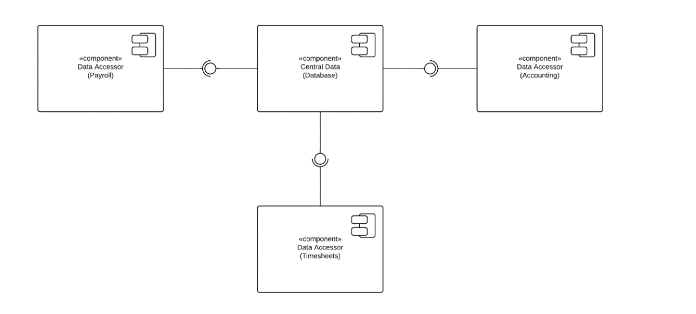

# Repository Based Sytstems

Mordern software system rarely operate in an isolated enviroments.

A number of issues need to be addressed to do this:

A number of issues need to be addressed to do this:

>1. The state of a component is only temporary while the
component is running. This means that any objects created
and any amount of data processing will be lost when the
component stops running.
>2. Components may not need all the data that is stored in the
files. There needs to be a way to communicate the state of
the data between multiple components.

To solve the previous two problems, a **data-centric software architecture** can be used.

At the core of a data-centric architecture are two types of components
1. **central data**
> The component used to store and serve data across all components that connect to it.
2. **Data accessor**
> Are the components that connect to the central data component. The data accessors make queries and transactions against the information stored in the database.

 
Bellow is a diagram of a data-centric software architecture.
 
 

## Components in reposotory-based architecture

### Databases

Database ensure serveral data qualities, which are important to data-centric architectures. These are

1. **Data integrity**
> A database encures that data is accurate and consitent over itss lifespan.
2. **Data persistence**
>A database ensures that data will live on after a process has been terminated-databses can save data from any number of components

 
Relational databases are a type of databases taht use tbales. Each table represents an abstraction.

 
In data-centric architecture design, the central data is passive.
Central data is primarily concerned with storing and serving inforamation, not with heavy data processing or large amounts of business logic.

### Data Accessors

**Data accessors** are any components that connects to a database.

 

>1. **Using transactions to promise the data accurate and integrity.**

**A data accesor contains all the business rules required to perform its functions.**. This means that this software achitecture enables you to seperate concerns into different, specialized data accessors.

 

### Advantages/Disadvantage of data-centric architecture

- Advantages
>1. Increased surpport of data integrity, data backup, and data restoration
>2. Reduced overhead for data transfer between data accessor,
>3. A system that can be easily scaled up, as data accessor are functionaly independent.

 

- Disadvantages
>1. It is difficult to change existing data schema, particularly if a large amount of data is already stored. **Data schema changes will affect data accssors.**
