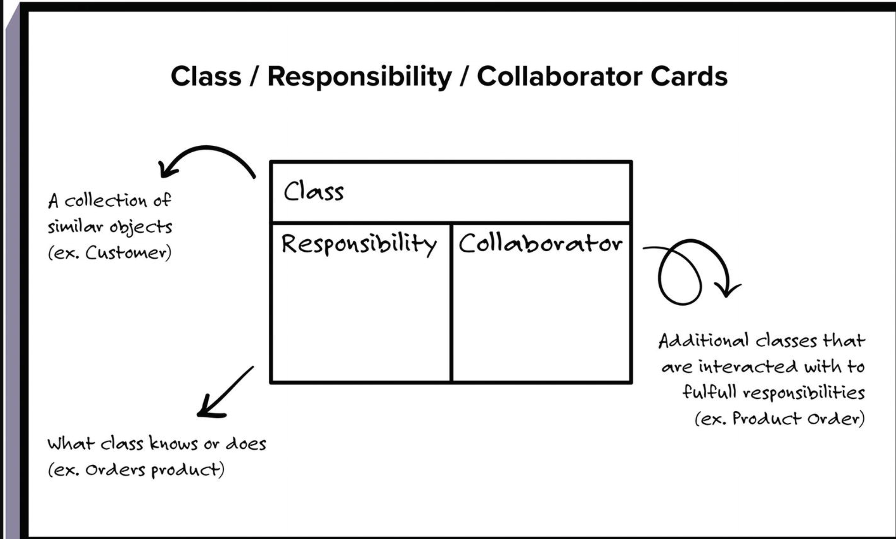

# Course Orientation

Build resuable, maintainable, flexiable code.

The course instructor try to aline with ACM/IEEE Software Engineering Curriculumn Guidelines.

This series consists four courses

>1. Object-Oriented Design
>2. Deisgn-Patterns
>3. Software architecture
>4. Service-Oriented Architecture

## Software designer and the Software architecture

>1. Software Design: Looks at the lower-leve aspect of a system
>2. Software architecture: Looks at the higher-level aspects of a system

## Object-Oriented Modeling

When solving a problem, object-oriented modeling involves the practice of representing key concepts through objects in your software.

## Desin in the Software Process

Evidence suggests that diving straight into implementation work is a leading cause of project failure.

>1. Requirements
>2. Design

Ask clients trade off, requirements(including potential one). Thinking about your software's

>1. Structure
>2. Behavoirs

Design activity involves 
>1. conceptual design
>2. technical design.

The clear your conceptual design is, the better your technical design will be.

Continuously check with client that your mockup capture what they want.

## Components

Components turn into a collection of functions, classes, or other components. These pieces then represent a much simpler problem that the developers can individually implement.

## Competing quality and trade off

- What must to be done
- What is good enough

## Class Responsibility collaborator(CRC)

Represents
>1. Class
>2. Responsibility
>3. Collaborator(connections)

CRC cards are used to record, organize, refine the components in your design.

**Colaborator** are other classes that the class interacts with to fullfill its responsibilities.

Keep the component and class small(single responsibility?)