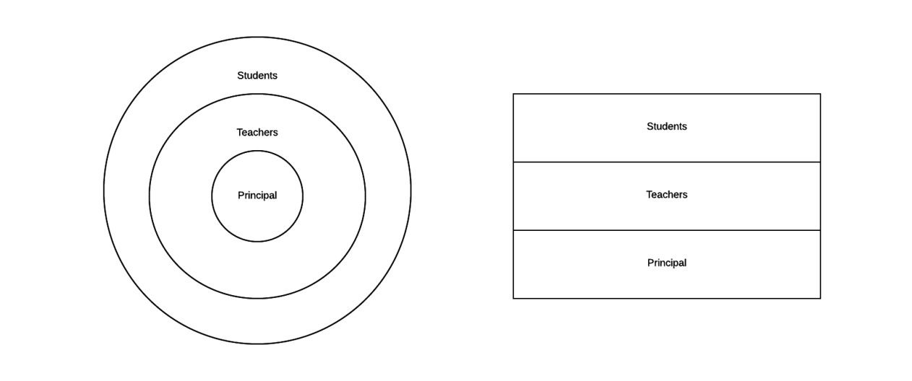
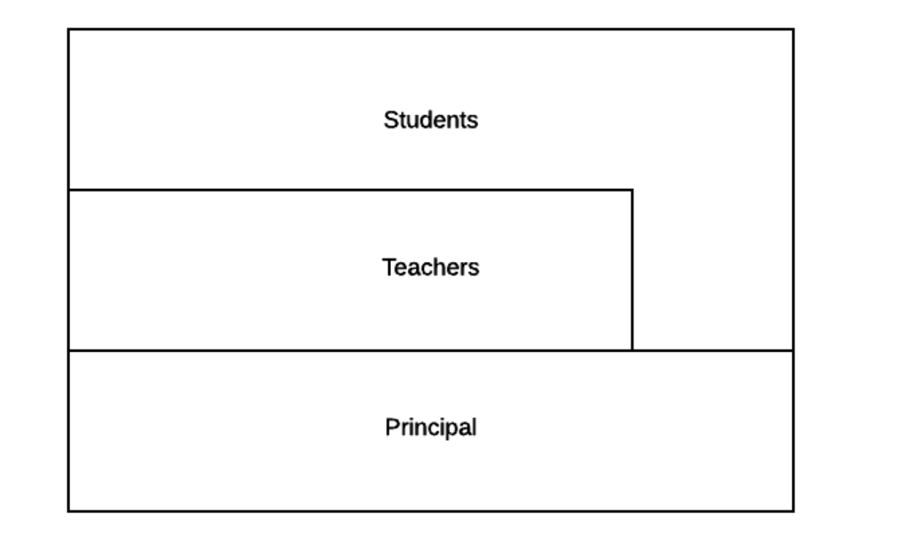
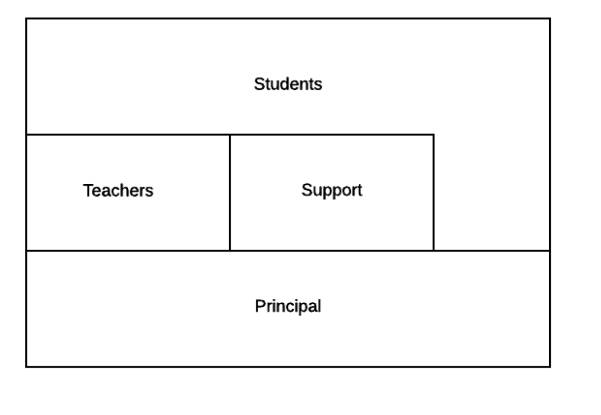

# Layered Systems

In software , a layer is a collection of components that work together towwards a common purpose. The charateristic of a layered architecture is **that the components in a layer only interact with components.

Layering allows for applying “separation of concerns” into each of
the layers.

Advantages of layered systems include the fact that:
>1. Users can perform complex tasks without needing to
understand the layers below.
>2. Different layers can be run at different levels of authorization
or privilege. Typically, the top layer is considered the “user
space” that does not have authority to allocate system
resources or communicate with hardware directly. This
“sandboxing” provides security and reliability to the kernel.
>3. Designs will be more loosely coupled, as layered
architecture follows **the principle of least knowledge**

 

Most notably, enforcing layers has an efficiency trade-off. **If only adjacent
layers can communicate, then the system will likely have some
interactions that pass through one layer to the next, and sometimes
information must be shared between layers that are not adjacent.**
This extra communication adds complexity and uses up processing resources.

## An example

- **V1**

-**V2**

-**V3**:  
Some layered systems may have more than one grouping in a layer.

